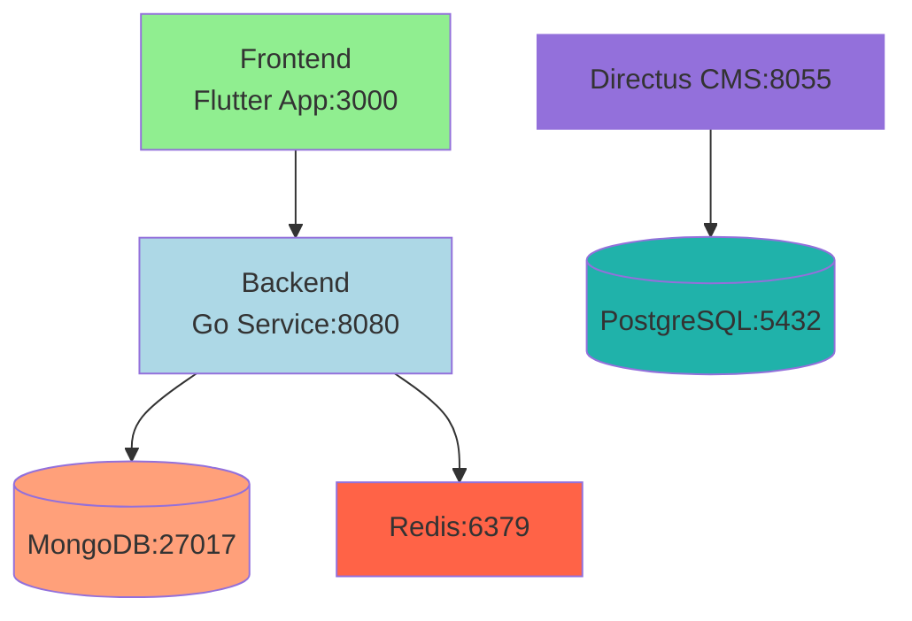
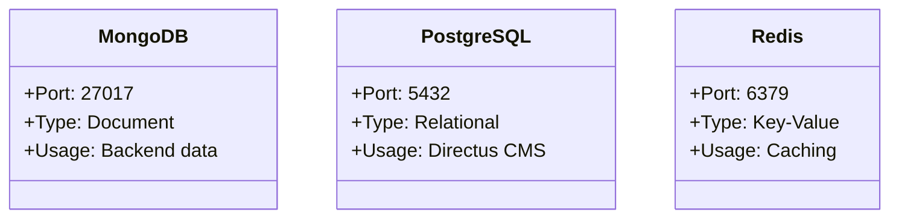
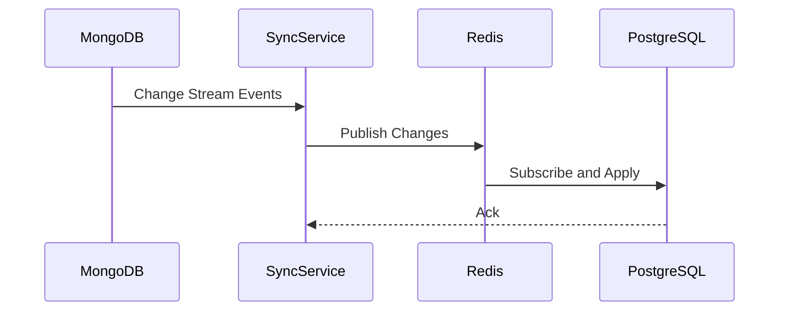

# MercadoMío 🏪


## Complete E-commerce Platform 🌟

A professional **Order Management System** with **Payment Processing** built using modern technologies:

- **🛠️ Backend**: Go + MongoDB + Redis + Stripe Payments
- **📱 Frontend**: Flutter + Material You Design + Professional UI
- **🔐 Security**: JWT Authentication + Payment Security
- **🧪 Testing**: 100% Test Coverage + TDD Development
- **🚀 Production**: Docker + Containerized + Scalable

### ✨ Features

#### 🎨 Order Management (v0.0.2)
- ✅ **Complete Order Lifecycle**: Cart → Order → Payment → Tracking → Delivery
- ✅ **Professional UI**: Material You design with gradients & animations
- ✅ **Real-time Tracking**: Status updates with timeline visualization
- ✅ **Mobile-First**: Touch-optimized e-commerce experience

#### 💳 Payment Processing
- ✅ **Stripe Integration**: Secure PaymentIntent processing
- ✅ **Production Ready**: Webhooks + status synchronization
- ✅ **Demo Mode**: Payment simulation for testing
- ✅ **Error Handling**: Comprehensive payment validation

#### 🔐 Security & Auth
- ✅ **JWT Authentication**: Secure login/registration
- ✅ **User Ownership**: Protected order access
- ✅ **Payment Security**: PCI-compliant payment processing

#### 🧪 Quality Assurance
- ✅ **7/7 Tests Passing**: Comprehensive test coverage
- ✅ **TDD Development**: Tests-first professional workflow
- ✅ **Clean Builds**: No warnings, production-ready

## Architecture Overview



### Components
- **Frontend**: Flutter application (port 3000)
- **Backend**: Go service using MongoDB (port 8080)
- **Directus**: CMS using PostgreSQL (port 8055)
- **Redis**: Caching service (port 6379)

## Services



### Database Services
- **MongoDB**: Document database for backend (port 27017)
- **PostgreSQL**: Relational database for Directus (port 5432)

### Application Services
- `backend`: Go service (MongoDB)
- `frontend`: Flutter web app
- `directus`: Headless CMS (PostgreSQL)

## 🚀 How to Run the Application

### Method A: Docker (Recommended) 🐳

**Prerequisites:**
- Docker & Docker Compose installed
- Ports 3000, 8080, 8055 available

**Start Everything:**
```bash
# Clone the repository
git clone https://github.com/hugomf/mercadomio.git
cd mercadomio

# Start all services (MongoDB, Redis, Backend, Frontend, CMS)
docker-compose up -d --build

# Check status
docker-compose ps

# View logs
docker-compose logs -f
```

**Access Applications:**
- 🌐 **Frontend (Order Management UI)**: http://localhost:3000
  - Tap "Orders" tab to see professional order interface
  - Login/Register to view order history & details
- 🚀 **Backend API Health**: http://localhost:8080/health
- 🎨 **Directus CMS**: http://localhost:8055

### Method B: Local Development 💻

**Prerequisites:**
- Go 1.24+, MongoDB, Redis running locally
- Flutter SDK for mobile development
- Node.js for CMS (if needed)

**1. Backend (Go):**
```bash
cd backend

# Copy environment
cp .env.example .env
# Edit .env with your MongoDB/Redis URLs

# Install dependencies
go mod tidy

# Run tests
go test ./tests -v

# Start server
go run main.go
```
Backend runs on: http://localhost:8080

**2. Frontend (Flutter):**
```bash
cd frontend

# Get dependencies
flutter pub get

# Run on web (Chrome)
flutter run -d chrome

# Or run on iOS simulator
flutter run -d <device_id>
```
Frontend runs on: http://localhost:3000

**3. Demo Flow:**
1. Open Flutter app at http://localhost:3000
2. Register/Login with any credentials (will create account)
3. Go to "Orders" tab
4. Click "View Order History" to see empty state
5. Click "View Order Details" to see mock data with UI components
6. Try Payment Integration features (simulation mode)

## 🧪 Testing & Development

**Run Backend Tests:**
```bash
cd backend
go test ./tests/order_test.go ./tests/auth_test.go ./tests/category_filter_test.go -v
```

**Run Frontend Tests:**
```bash
cd frontend
flutter test
```

**Development Workflow:**
- Feature branch → write tests → implement → test → commit
- All tests must pass before commits
- Update CHANGELOG.md for releases
- Use descriptive commit messages

## 🔗 API Endpoints

**Core APIs:**
- `POST /api/auth/register` - User registration
- `POST /api/auth/login` - JWT authentication
- `GET /api/auth/profile` - User profile (protected)
- `POST /api/orders` - Create order from cart (protected)
- `GET /api/orders` - User order history (protected)
- `GET /api/orders/:id` - Order details (protected)
- `POST /api/payments/create-payment-intent` - Create Stripe PaymentIntent (protected)
- `POST /api/payments/confirm` - Confirm payment (protected)
- `POST /api/payments/simulate-success` - Demo payment simulation (protected)

**API Documentation:** See `docs/api-documentation.md` for complete specs.

## ⚙️ Configuration

**Backend (.env):**
```bash
MONGODB_URI=mongodb://localhost:27017
REDIS_ADDR=localhost:6379
STRIPE_SECRET_KEY=sk_test_your_stripe_key
STRIPE_PUBLIC_KEY=pk_test_your_stripe_key
JWT_SECRET=your_secret_key
```

**Stripe Setup:**
1. Get API keys from [Stripe Dashboard](https://dashboard.stripe.com/apikeys)
2. Add to backend `.env` file
3. For testing, use [Stripe Test Cards](https://docs.stripe.com/testing#cards)

**Quick Docker Setup:**
```bash
git clone https://github.com/hugomf/mercadomio.git
cd mercadomio
docker-compose up -d --build
# Access: http://localhost:3000
```

## Testing

To run backend tests and see coverage:

```bash
cd backend
go test -coverprofile=coverage.out ./fragments
go tool cover -func=coverage.out
```

## Contributing

1. Fork the repo and create your branch from `main`.
2. Make your changes and add tests.
3. Run tests and ensure coverage is high.
4. Submit a pull request!

## License

This project is licensed under the MIT License.

## Links

- [GitHub Repo](https://github.com/hugomf/mercadomio-copilot)
- [Issues](https://github.com/hugomf/mercadomio-copilot/issues)
- [Directus](https://directus.io/)
- [Flutter](https://flutter.dev/)

## Volumes
- `mongo_data`: MongoDB data persistence
- `postgres_data`: PostgreSQL data persistence
- `redis_data`: Redis data persistence

## Data Synchronization



### Synchronization Strategy

1. **MongoDB Change Streams**:
   - Monitor product collection changes
   - Capture create/update/delete events

2. **Redis Pub/Sub**:
   - Acts as message broker
   - Decouples MongoDB and PostgreSQL

3. **Sync Service**:
   - Processes change events
   - Maintains data consistency
   - Handles conflicts and retries

### Implementation Notes

- Critical operations use transactions
- Eventual consistency model
- Monitoring for drift detection

## Maintenance

To completely reset the system:

```bash
docker-compose down -v
```

To view logs:

```bash
docker-compose logs -f [service_name]
```
