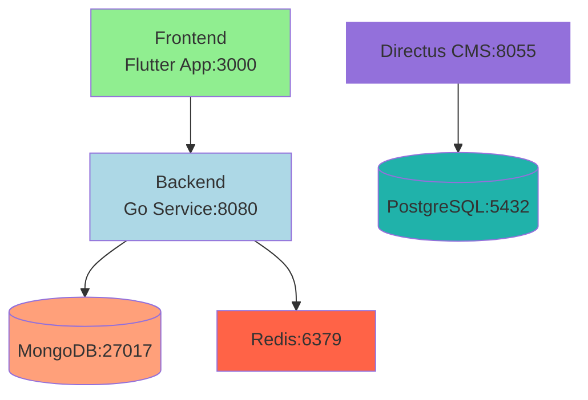
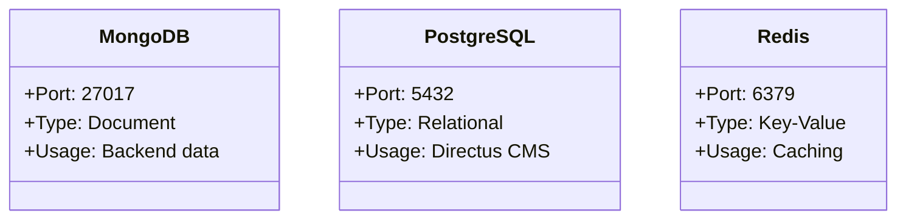
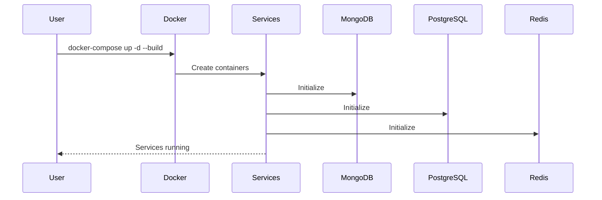
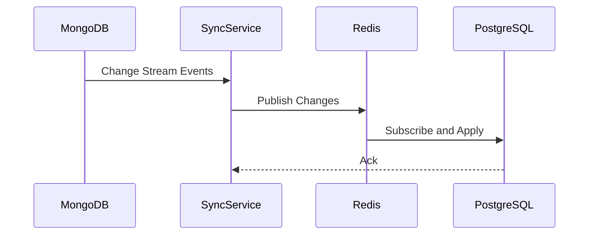

# MercadoMio


# MercadoMio

Hybrid database architecture project with MongoDB and PostgreSQL.

## Architecture Overview



### Components
- **Frontend**: Flutter application (port 3000)
- **Backend**: Go service using MongoDB (port 8080)
- **Directus**: CMS using PostgreSQL (port 8055)
- **Redis**: Caching service (port 6379)

## Services



### Database Services
- **MongoDB**: Document database for backend (port 27017)
- **PostgreSQL**: Relational database for Directus (port 5432)

### Application Services
- `backend`: Go service (MongoDB)
- `frontend`: Flutter web app
- `directus`: Headless CMS (PostgreSQL)

## Setup Instructions



1. **Prerequisites**:
   - Docker and Docker Compose installed
   - Ports 3000, 8055, 8080 available

2. **Start services**:
```bash
docker-compose up -d --build
```

3. **Access services**:
- Frontend: http://localhost:3000
- Backend API: http://localhost:8080
- Directus CMS: http://localhost:8055


## Environment Variables

### Backend (Go)
- `MONGODB_URI` (default: `mongodb://mongo:27017`)
- `MONGODB_DBNAME` (default: `mercadomio`)
- `REDIS_ADDR` (default: `redis:6379`)

### Frontend (Flutter)
- See `frontend/.env` or `pubspec.yaml` for any required variables

### PostgreSQL (Directus)
- `POSTGRES_USER=admin`
- `POSTGRES_PASSWORD=admin123`
- `POSTGRES_DB=mercadomio`

### Directus
- `DB_CLIENT=pg`
- `DB_HOST=postgres`
- `DB_PORT=5432`
- `DB_DATABASE=mercadomio`
- `DB_USER=admin`
- `DB_PASSWORD=admin123`
## Quick Start

1. **Clone the repository:**
   ```bash
   git clone https://github.com/hugomf/mercadomio-copilot.git
   cd mercadomio-copilot
   ```
2. **Start all services:**
   ```bash
   docker-compose up -d --build
   ```
3. **Access the apps:**
   - Frontend: http://localhost:3000
   - Backend API: http://localhost:8080
   - Directus CMS: http://localhost:8055

## Testing

To run backend tests and see coverage:

```bash
cd backend
go test -coverprofile=coverage.out ./fragments
go tool cover -func=coverage.out
```

## Contributing

1. Fork the repo and create your branch from `main`.
2. Make your changes and add tests.
3. Run tests and ensure coverage is high.
4. Submit a pull request!

## License

This project is licensed under the MIT License.

## Links

- [GitHub Repo](https://github.com/hugomf/mercadomio-copilot)
- [Issues](https://github.com/hugomf/mercadomio-copilot/issues)
- [Directus](https://directus.io/)
- [Flutter](https://flutter.dev/)

## Volumes
- `mongo_data`: MongoDB data persistence
- `postgres_data`: PostgreSQL data persistence
- `redis_data`: Redis data persistence

## Data Synchronization



### Synchronization Strategy

1. **MongoDB Change Streams**:
   - Monitor product collection changes
   - Capture create/update/delete events

2. **Redis Pub/Sub**:
   - Acts as message broker
   - Decouples MongoDB and PostgreSQL

3. **Sync Service**:
   - Processes change events
   - Maintains data consistency
   - Handles conflicts and retries

### Implementation Notes

- Critical operations use transactions
- Eventual consistency model
- Monitoring for drift detection

## Maintenance

To completely reset the system:

```bash
docker-compose down -v
```

To view logs:

```bash
docker-compose logs -f [service_name]
```
