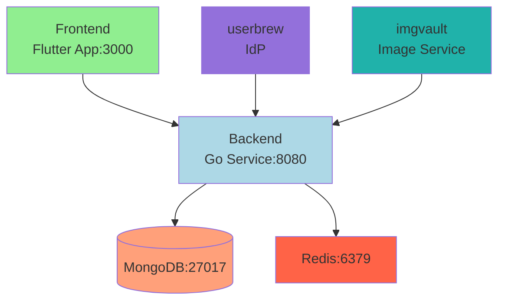

# MercadoMío 🏪


## Mexican Grocery E-commerce Platform

A professional **Order Management System** with **Payment Processing** built using modern technologies:

- **🛠️ Backend**: Go + MongoDB + Redis + Conekta Payments
- **📱 Frontend**: Flutter + Material You Design + Professional UI
- **🔐 Security**: OIDC Authentication via userbrew (PKCE)
- **🧪 Testing**: Backend unit tests + TDD Development
- **🚀 Production**: Docker + Containerized + Scalable

### ✨ Features

#### 🎨 Storefront
- ✅ **Product Catalog**: Search, filter, category browsing
- ✅ **Shopping Cart**: Add/remove items, quantity management
- ✅ **Checkout**: Saved addresses/payments, terms acceptance
- ✅ **Order History**: Status filters, search, mobile-friendly
- ✅ **Wishlist**: Save favorite products

#### 💳 Payment Processing
- ✅ **Conekta Integration**: Secure hosted checkout
- ✅ **Webhooks**: Payment status synchronization
- ✅ **Error Handling**: Comprehensive payment validation

#### 🔐 Security & Auth
- ✅ **OIDC Authentication**: Via userbrew IdP
- ✅ **PKCE Flow**: Secure token exchange
- ✅ **Protected Routes**: Order ownership validation

#### 🧪 Quality Assurance
- ✅ Backend unit tests
- ✅ Clean builds, production-ready

## Architecture Overview


```mermaid
flowchart TD
    A[Frontend\nFlutter App:3000] --> B[Backend\nGo Service:8080]
    B --> C[(MongoDB:27017)]
    B --> D[Redis:6379]
    E[userbrew\nIdP] --> B
    F[imgvault\nImage Service] --> B
    style A fill:#90EE90
    style B fill:#ADD8E6
    style C fill:#FFA07A
    style D fill:#FF6347
    style E fill:#9370DB
    style F fill:#20B2AA
```

### Components
- **Frontend**: Flutter application (port 3000)
- **Backend**: Go service using MongoDB (port 8080)
- **Redis**: Caching service (port 6379)
- **userbrew**: OIDC Identity Provider
- **imgvault**: Image storage/transformation service

## Run it

Local dev uses the scripts in `scripts/` (which load `backend/local.env`):

```bash
# Full dependent stack (Mongo, Redis, platform services) + backend
./scripts/start.sh

# Storefront (Flutter web)
./scripts/frontend.sh

# Admin console (Flutter web)
./scripts/admin-console.sh
```

Seeds are in `seed/` (e.g. `seed/seed_grocery.sh`); `seed/scrape-natura-api.sh`
imports the product catalog.

See `docs/setup.md` for detailed setup instructions.

## Backend

```bash
cd backend
cp .env.example .env   # or backend/local.env via scripts/start.sh
GOROOT= go build ./...          # builds against the repo Go toolchain
GOROOT= go vet ./...
go test ./...
go run main.go                   # serves on :8080, /health
```

> Note: AGENTS.md documents that the checked-out `go` may point at an older
> gvm toolchain. Build with `GOROOT=` unset to use the updated one, or verify
> `go version` first.

## API

Public/paginated endpoints under `/api`:

- `GET /api/products` — product listing w/ search (`q`, `category`, `minPrice`,
  `maxPrice`, `type`, `sort`, `order`)
- `GET /api/products/:id` — product detail
- `GET /api/categories` — category tree (nested, image-resolved)
- `GET /api/cart/:cartId` and cart mutation endpoints (optional auth)
- `GET /api/orders`, `GET /api/orders/:id`, `POST /api/orders`
- `GET /payments/confirmation`, `/payments/cancelled` — provider redirect pages

## Admin Console

```bash
cd admin_console
flutter pub get
flutter run -d chrome
```

## Testing

To run backend tests:

```bash
cd backend
go test ./...
```

## Contributing

1. Fork the repo and create your branch from `main`.
2. Make your changes and add tests.
3. Run tests and ensure builds pass.
4. Submit a pull request!

## License

This project is licensed under the MIT License.

## More docs

- `docs/api-documentation.md` — API reference
- `docs/AUTH-ARCHITECTURE.md` — OIDC/userbrew auth design
- `docs/ROADMAP.md` — development roadmap
- `docs/SESSION_LOG.md` — change history
- `docs/setup.md` — local development setup
